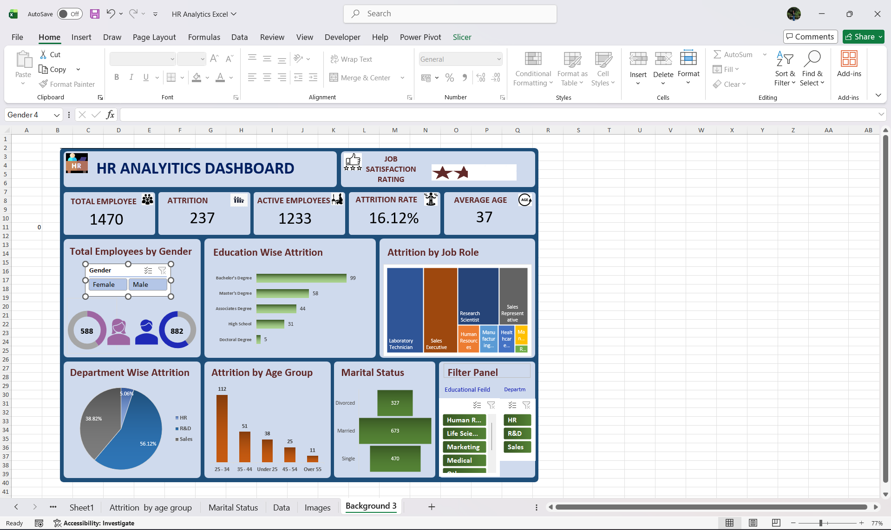

# HR Analytics – Employee Attrition Dashboard

An interactive HR dashboard built on the IBM HR Analytics Attrition dataset (1,470 employees), 
designed to help HR teams identify attrition patterns by department, age, education, and gender.

## 🔧 Tools Used
- Excel PivotTables & PivotCharts
- Slicers for interactive filtering
- GETPIVOTDATA for dynamic KPI cards

## 📊 Key Insights
- Overall attrition rate: **16.12%** (237 of 1,470 employees)
- **25–34 age band** accounts for nearly half of all attrition (112 of 237)
- **R&D** has the highest attrition share (56%), followed by Sales (39%) and HR (5%)
- Bachelor's degree holders have the highest attrition count (99)

## 🐛 A bug I caught and fixed
While QA-ing my own dashboard, I found my KPI cards showing 882 employees instead of the 
real 1,470 — a Gender slicer had been left filtered to "Male" when the pivot cache was saved, 
silently skewing my attrition rate. I traced it via a raw row count vs. pivot output mismatch, 
reset the slicer, and also caught a Grand Total row bleeding into two of my PivotCharts. 
Both are fixed in this version — a good reminder to always validate pivot output against 
the raw dataset before calling a dashboard final.

## 📁 Files
- `HR_Analytics_Dashboard.xlsx` — full workbook with source data, pivot tables, and dashboard
- `/screenshots` — dashboard preview images

## 📈 Dataset
IBM HR Analytics Employee Attrition dataset (1,470 rows, 35 attributes)
